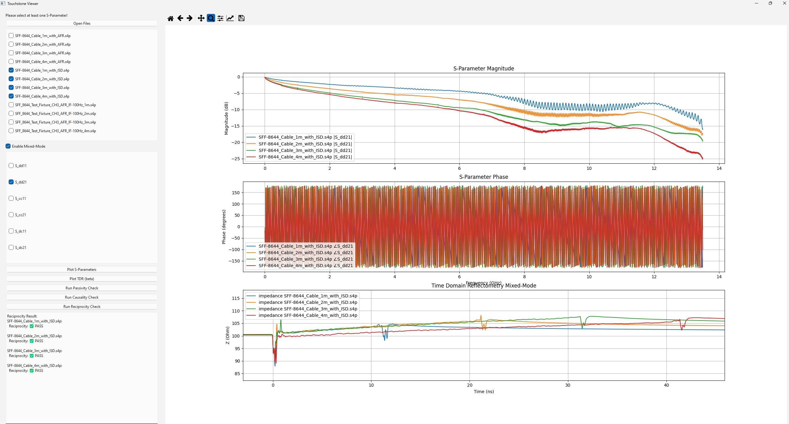

# Touchstone Viewer

## Overview
The **Touchstone Viewer** is a GUI-based tool for visualizing S-parameter files (.s2p, .s4p) using **scikit-rf** and **PyQt6**. It allows users to:

- Load multiple Touchstone files simultaneously.
- Enable/disable specific files for plotting.
- Toggle between standard and mixed-mode S-parameters.
  
  Port Numbering Convention:
  ```
    Single Ended 4-port                           Differential 2-port
          _________                                 
         |         |                                
    1 ___|   -->   |___3                               _________
         |         |           translates into        |         |
    2 ___|   -->   |___4                           1--|   -->   |--2
         |         |                                  |_________|
         |_________|
  ```


- Interactively resize the Matplotlib canvas.
- Export plotted data for further analysis.
- Generate an executable version for standalone use.

## Features
✅ Load multiple S-parameter files (.s2p, .s4p).  
✅ Enable/disable specific files using checkboxes.  
✅ Convert to Mixed-Mode (se2gmm) for 4-port networks.  
✅ Log-magnitude (dB) plots with frequency in GHz.  
✅ Interactive resizing of plots.  
✅ Standalone executable via PyInstaller.  

## Installation
### Prerequisites
Ensure you have **Python 3.13.2** installed.

### Install Dependencies
Run the following command to install required packages:
```sh
pip install numpy matplotlib pyqt6 scikit-rf
```

## Usage
### Run the Application
To start the Touchstone Viewer, execute:
```sh
python touchstone_viewer.py
```

### Load S-Parameter Files
1. Click **"Open File"** and select one or more `.s2p` or `.s4p` files.
2. Use the checkboxes to enable/disable specific files.
3. If applicable, check **"Enable Mixed-Mode"** for 4-port networks. 

### Plot S-Parameters
1. Select desired S-parameters using checkboxes.
2. Click **"Plot S-Parameters"** to visualize the data.
3. Resize the plot interactively using the mouse.



### Plot TDR
1. Click **"Plot TDR** to visualize the data. It will visualize S11 for Single Ended and SDD11 for Mixed Mode.
3. Resize the plot interactively using the mouse.


### Run S-Parameter Checks
1. Select desired S-parameters using checkboxes.
2. Click **"Run Passivity Check"** to check for Passivity of the network
   - Ensures that the network doe not generate energy, meaning no S-Parameter magnitued should exceed 1 (0 dB)
   - This check is crucial for passive components like filters, attenuator and cables.

3. Click **"Run Causality Check"** to check for Causality of the network
   - Ensures that future signals do not influence past signals (i.e. real-world behaviour)
   - A non-causal response suggests incorrect time-domain beahavior, such as truncation artifacts in frequency-domain measurements.

4. Click **"Run Reciprocity Check"** to check for Reciprocity of the network according to:
   - Ensures that the network behaves the same in both directions (common for passive reciprocal devices like cables, filters and antennas)

### Create a Standalone Executable
To build an `.exe` file:
```sh
pyinstaller --onefile --windowed --name TouchstoneVisualizer ./TouchstoneAnalyzer.py
```
This generates an executable in the `dist/` folder.

## Troubleshooting
- **PyInstaller not recognized?** Ensure it is installed:
  ```sh
  pip install pyinstaller
  ```
- **PyQt6-related errors?** Try reinstalling:
  ```sh
  pip install --force-reinstall pyqt6
  ```
- **Plot labels cut off?** Ensure the window is resized properly.

## Contributions
For issues or feature requests, feel free to contribute by **pull requests**!

## License
This project is licensed under the GNU **General Public License (GPL)** – you are free to use, modify, and distribute it, but any derivative work must also be open-source under the same license.

## About Author
Ey, I am Edgar👋🏼

I’m an electronics designer and with 15+ years of experience in companies across automotive, industrial, medical, and IoT sectors. Ever since I was interested in computers and finally let my passion come true by becoming a Motherboard Designer. I created x86 and ARM based motherboards with AMD, Intel and Nvidia Chipsets. During that time I specialized in Signal and Power Integrity. 

### Where to find me?
[Linkedin](https://de.linkedin.com/in/edgar-merger-09704411a)